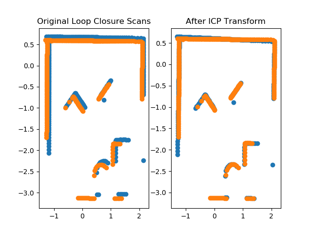

<!-- Main -->

<section id="Two" class="spotlights">
	<section>
		
		

			

				<header class="major">
					<h2>2D LiDAR Based SLAM</h2>
				</header>
				
The goal of our project was to implement a basic SLAM alorithm using a physical Neato from Olin. SLAM is a class of algorithms for simultaneously mapping an area and locating the robot within that map. We used the Neato's built-in LiDAR and wheel encoders to sense the environment, and a method called Graph Optimization to map it.

			

		

	</section>
	<section>
		
		

			

				<header class="major">
					<h3>Collecting Data</h3>
				</header>
				
To use graph optimization for SLAM, we recorded the locations of the robot and its LiDAR measurements in the odometry reference frame as nodes on a graph. We recorded the distance between these points, as measured by the sensors, as edges between those nodes. So long as all the measurements agree, there is no optimization to be done, and we can plot the data directly. However, none of our sensors are perfect, so we are likely to get a graph that resembles the one to the left. 

			

		

	</section>
	<section>
		
		

			

				<header class="major">
					<h3>Loop Closure</h3>
				</header>
				
Once we have multiple measurements of the same landmark or location, we will have conflicting information because the sensors will never entirely agree. Graph Optimization optimizes the entire graph to reconcile the mismatched readings with the minimum possible change. Finding a landmark that you have re-scanned is called Loop Closure, and it is what enables graph optimization to be more than a simple plot of sensor data. 

				<ul class="actions">
					<li><a href="generic.html" class="button">Learn more</a></li>
				</ul>
			

		

	</section>
	<section>
		
		

			

				<header class="major">
					<h3>Iterative Closest Points</h3>
				</header>
				
We chose to generate loop closures by recording when the robot's odometry thought it had returned to its original position. This is an unsophisticated method, and wouldn't work if the odometry readings were bad enough, but it let us test the whole system. Once the robot returned to its original position, it would have two scans ostensibly in the same location. These scans will inevitably match imperfectly, and the constraint we need to run graph optimization is the real distance between the robot's position when it took the first scan, and the robot's position when it took the second scan. We ran an algorithm called Iterative Closest Points to find this transform, and used that as our loop closure.

			

		

	</section>
	<section>
		
		

			

				<header class="major">
					<h3>After ICP</h3>
				</header>
				
After calculating the transform between two scans using ICP, we applied the transform to the original scan, and plotted before/after the transform for comparison. We tuned the number of iterations to give us the figure you see on the right.

			

		

	</section>
	<section>
		
		

			

				<header class="major">
					<h3>G2opy</h3>
				</header>
				
With a set of measurements and a loop closure, we were able to feed our data into g2opy, a python library built for graph optimization for SLAM. The results were... uninspiring.

			

		

	</section>
</section>

