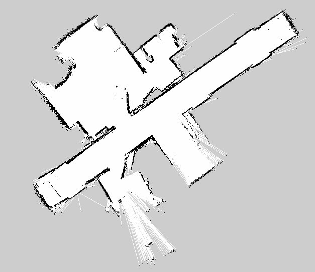

## LiDAR SLAM Themes for Neato Quarantines

Eamon O'Brien and Emma Pan
Comprobo 2020

### Blog Post 1
We started our final project by researching the [SLAM](https://www.mathworks.com/discovery/slam.html) (Simultaneous Location and Mapping) algorithm, in order to map a room in our house using a physical NEATO robot. During our exploration, we discovered that SLAM can be done using different types of sensors, including but not limited to LiDAR, camera, audio, or a combination of multiple inputs. Since the neato we have is already equipped with LiDAR sensors, and because handling LiDAR data is more straightforward than dealing with images, we decided to use just LiDAR input for our SLAM implementation. 

Since the neato’s LiDAR is 2D, we are restricted to a 2D implementation of LiDAR SLAM. Even with these specifications, we discovered that there are many approaches we could take for implementation. One commonly used method is GMapping, which has an open source [implementation](https://openslam-org.github.io/) available in ROS. The method we chose for this project is [graph optimization](http://www2.informatik.uni-freiburg.de/~stachnis/pdf/grisetti10titsmag.pdf), because it is a well-documentated and pretty [intuitive](https://towardsdatascience.com/everything-you-need-to-know-about-graph-slam-7f6f567f1a31) implementation of LiDAR SLAM, with python libraries that can provide scaffolding for our learning. After deciding on graph optimization, we did some preliminary research on that method. One great resource for learning about the process can be found [here](https://www.youtube.com/watch?v=saVZtgPyyJQ).

We will be doing a procedure very similar to what’s shown in the video with our neato, using the built in LiDAR and odometry to gather nodes and edges. The optimizing itself will be handled by the python library [G2opy](https://github.com/uoip/g2opy), which leaves only the major task of recognizing loop closure. Our next job (once we have the robot ready to run code) will be researching ways to do this. So far, it seems likely that we will need to program some way for the neato to recognize landmarks in the map that it has already seen, and use that to know that it has returned to a spot.

Our neato will be arriving in the mail today, so in parallel with our research we’re going to run the premade SLAM implementation from the particle filter project on our physical robot to start finding the extra complications that come with real-world systems.

Some of the challenges we think we’re likely to run into are shapes in our house (like chairs) that our neato will have trouble recognizing with its 2D sensor system, getting messy data from the LiDAR that we need to filter, and trouble with the robot moving between smooth and carpeted areas.

### Blog Post 2
As we suspected, working with the physical neato onvolved debugging many more obscure bugs than the simulated version. We spent much of our time over the last couple weeks trying to connect to the neato over wifi with help from Paul. Eventually, he tracked down a fairly subtle error in the configuration files, and we were able to wirelessly connect our laptop to the robot. Since then, the neato has been surprisingly easy to work with, and we've been able to quite effectively run code from previous projects on it.

While this was a frustrating process, it was productive in that we got practice working with actual robotics hardware, which was a learning goal for both of us in this project. One very fun outcome is that we have already been able to map our house with the neato using the built in SLAM algorithm from the [particle filter](https://viahtml3.hypothes.is/proxy/https://comprobo20.github.io/assignments/robot_localization?via.client.openSidebar=1&via.client.requestConfigFromFrame.origin=https%3A%2F%2Flms.hypothes.is&via.client.requestConfigFromFrame.ancestorLevel=2&via.external_link_mode=new-tab) project. 

Once the robot was functional, we attempted to begin work on the graph optimization SLAM, but quickly hit another bug installing [G2opy](https://github.com/uoip/g2opy). After a great deal of fiddling with libraries and dependencies, we decided to look for a different library. We found [another](https://pypi.org/project/graphslam/) python wrapper for graph optimization which was much more recently updated, and also had robust documentation. This library was quite simple to install.

After the wifi issues, trouble with g2opy, as well as one of our two laptops dying and a couple days spent attending to gas leaks and power outages, we are behind our intended schedule for the project. Our next step will be to implement the most basic possible version of SLAM as a base to work off of. We will translate scan data based on odometry with no correction for flaws in the sensor data, and make a map out of that. This will be a non-trivial task, but we hope it will be doable by the middle of this week.
